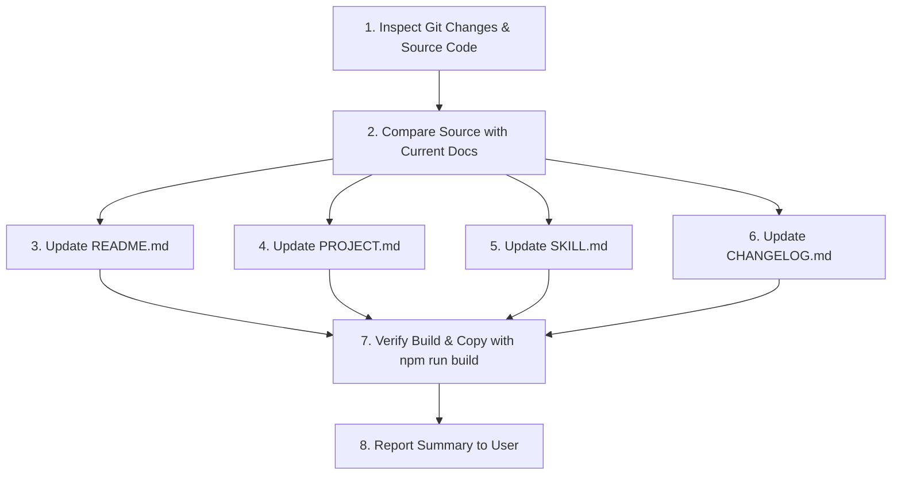

# Update Documentation Skill (@jsweb/ui)

This skill guides the agent through auditing codebase changes and systematically synchronizing all project documentation files (`README.md`, `PROJECT.md`, `SKILL.md`, `CHANGELOG.md`) to reflect the latest APIs, directives, modifiers, release notes, and architectural behaviors.

---

## Target Documentation Files

| File                                                               | Audience                     | Purpose                                                                                                                                 | Language             |
| :----------------------------------------------------------------- | :--------------------------- | :-------------------------------------------------------------------------------------------------------------------------------------- | :------------------- |
| [`README.md`](file:///d:/Projetos/github/jsweb/ui/README.md)       | Developers & End Users       | Public GitHub/NPM documentation, quickstart, installation, directives reference table, and usage examples.                              | Portuguese / English |
| [`PROJECT.md`](file:///d:/Projetos/github/jsweb/ui/PROJECT.md)     | Maintainers & Architecture   | Technical specification, core engine mechanics (Reactivity, Evaluator, Parser), architectural pillars, and requirements.                | Portuguese           |
| [`SKILL.md`](file:///d:/Projetos/github/jsweb/ui/SKILL.md)         | AI Coding Agents             | Operational knowledge base installed via `npx skills add @jsweb/ui`, defining rules, directives, APIs, patterns, and agent constraints. | English              |
| [`CHANGELOG.md`](file:///d:/Projetos/github/jsweb/ui/CHANGELOG.md) | All (Users, Maintainers, AI) | Curated chronological log of notable changes (Added, Changed, Deprecated, Removed, Fixed, Security) adhering to Keep a Changelog.       | Portuguese           |

---

## Workflow: Step-by-Step Procedure



### Step 1: Inspect Changes and Current Source

1. Check git status and recent diffs:
   ```bash
   git status
   git diff HEAD
   ```
2. Inspect the core implementation files in `src/`:
   - [`src/reactivity.ts`](file:///d:/Projetos/github/jsweb/ui/src/reactivity.ts): Check `reactive()`, `watch()`, `effect()`, `ReactiveEffect`, tracking, trigger behavior, bypassed types, or computed handling.
   - [`src/parser.ts`](file:///d:/Projetos/github/jsweb/ui/src/parser.ts): Check directives (`:scope`, `:text`, `:bind`, `:if`, `:for`, `:key`, `:class`, `:style`, `:ref`, `:[attr]`, `@[event]`), event modifiers (`.prevent`, `.stop`, `.self`, `.outside`), and context helpers (`$refs`, `$emit`, `$index`, `$key`).
   - [`src/evaluator.ts`](file:///d:/Projetos/github/jsweb/ui/src/evaluator.ts): Check expression sandboxing, `evaluate()`, and `evaluateEvent()`.
   - [`src/index.ts`](file:///d:/Projetos/github/jsweb/ui/src/index.ts): Check public exports and global window attachments (`window.jsweb.ui`).
   - [`package.json`](file:///d:/Projetos/github/jsweb/ui/package.json): Check version bumps, dependencies, entry points, or scripts.

### Step 2: Identify Discrepancies Across Documentation

Check whether any of the following changed:

- **New or changed directives**: Did the syntax, prefix, or behavior change?
- **New or changed event modifiers**: Are there new modifiers (e.g. `.debounce`, `.throttle`, `.once`) or modifications to existing ones?
- **Reactivity enhancements**: Changes to deep reactivity, collections, watch options, or computed getters?
- **API signatures**: Changes to parameters, options, or return types for `createScope`, `reactive`, or `watch`?
- **Context helpers**: Any newly exposed helper (like `$parent`, `$root`, `$dispatch`, etc.)?
- **Distribution / Build**: Changes to UMD/ESM paths, global variable name (`jsweb.ui`), or CDN URLs?

### Step 3: Synchronize Each Documentation File

#### A. Updating `README.md`

- Keep the directive summary table up to date with exact syntax, shorthand, and clear examples.
- Update code snippets demonstrating CDN standalone usage and ESM bundler usage.
- Ensure the event modifiers and `$refs` / `$emit` section matches actual runtime behavior.
- Document any breaking changes or version upgrades clearly.

#### B. Updating `PROJECT.md`

- Update the Technical Specifications (Section 3: Reatividade, Avaliador, Parser).
- Keep Section 4 (Sintaxe e Diretivas) aligned with the exact implementation in `parser.ts`.
- Document any architectural decisions (e.g., memory management, cleanup hooks, node recycling).

#### C. Updating `SKILL.md` (Root)

- Ensure YAML frontmatter `description` contains comprehensive trigger keywords.
- Update the API Reference section with precise TypeScript signatures and return types.
- Ensure the Template Directives reference accurately describes:
  - Form controls supported by `:bind` (input types, select, checkbox, radio).
  - Array and reconciliation behavior of `:for` and `:key`.
  - Class and style object/array evaluation rules.
  - `$refs` behavior (single element vs. nested `Map` in keyed loops).
  - Event modifiers and their exact execution flow.
- Maintain the "Critical Rules for AI Coding Agents" section (DOs and DON'Ts).

#### D. Updating `CHANGELOG.md`

- Adhere strictly to [Keep a Changelog](https://keepachangelog.com/pt-BR/1.1.0/) format.
- Group changes under `[Unreleased]` (or the specific version header if tagging/bumping version):
  - `### Added` for new features or capabilities.
  - `### Changed` for changes in existing functionality.
  - `### Deprecated` for soon-to-be removed features.
  - `### Removed` for now removed features.
  - `### Fixed` for any bug fixes.
  - `### Security` in case of vulnerabilities.
- Provide concise, user-focused descriptions with code references.

### Step 4: Validate Formatting and Build

1. Format all modified files with Prettier:
   ```bash
   npm run format
   ```
2. Run the build to ensure type safety and that `publish.js` syncs `README.md`, `LICENSE`, `SKILL.md`, and `CHANGELOG.md` to `dist/`:
   ```bash
   npm run build
   ```
3. Verify that `dist/README.md`, `dist/SKILL.md`, and `dist/CHANGELOG.md` contain the updated contents.

### Step 5: Report to User

Present a concise summary of:

- Which files were updated ([README.md](file:///d:/Projetos/github/jsweb/ui/README.md), [PROJECT.md](file:///d:/Projetos/github/jsweb/ui/PROJECT.md), [SKILL.md](file:///d:/Projetos/github/jsweb/ui/SKILL.md), [CHANGELOG.md](file:///d:/Projetos/github/jsweb/ui/CHANGELOG.md)).
- Specific sections added, modified, or removed in each file.
- Confirmation that `npm run build` and `npm run format` passed cleanly.

---

## Documentation Checklist

When updating documentation, verify each of these items:

- [ ] All directives in `parser.ts` are listed in both long form (`ui:*`) and shorthand (`:*`).
- [ ] All event modifiers supported in `processEventBinding` are documented.
- [ ] `$refs` behavior is accurately described (Map instance; nested Map in `:for` loops with `:key`).
- [ ] `$emit` parameters and CustomEvent details (`bubbles: true`, `composed: true`) are correct.
- [ ] Code snippets use valid modern JavaScript/TypeScript syntax.
- [ ] `CHANGELOG.md` has all notable modifications recorded under `[Unreleased]` or version tag.
- [ ] Version numbers in examples or text match `package.json`.
- [ ] Prettier formatting is applied (`npm run format`).
- [ ] `npm run build` succeeds and copies updated files to `dist/`.
